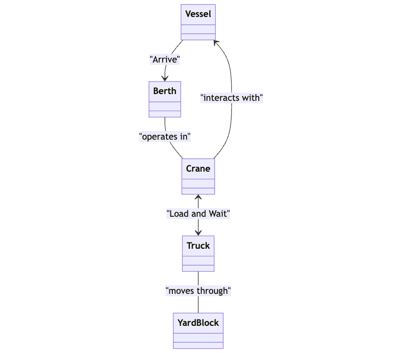
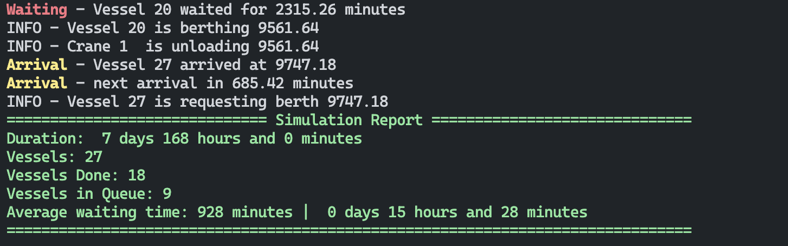

# Maersk Task: Simulating a container terminal using SimPy

## Installation and Running
I used Poetry to manage the dependencies and virtual environment, but there is a `requirements.txt` file for pip as well. Everything is handled with a Makefile. If Poetry is not installed, it uses Python `venv` to create a virtual environment.

1. Create a virtual environment
```bash
$ make install
```
2. run the simulation
```bash
$ make simulate
# or using proper python command
$ python -m maersk_task
```
3. Configuration
   
    You can find all configurations in [config.py](maersk_task/config.py) file. You can change the configuration as per your needs.

    You can configure:
    - Average vessel arrival time
    - Capacity of the vessel
    - Number of starting vessels (if set to 0, it will wait for the first vessel to arrive)
    - Number of berths
    - Number of cranes
    - Duration of crane to load/unload the container
    - Number of trucks
    - Duration of truck to load/unload the container
    - Log level (I used default logging levels)
      - `DEBUG`: Truck action logs
      - `INFO`: Vessel and crane action logs (default)
      - `WARNING`: Only vessel arrival and departure logs
      - `ERROR`: Final summary logs
    - Simulation time in minutes
    - > Based on the task defention I made the assumption that number of cranes and berth should be equal.
  ```python
class Config:
    vessel_average_in_minutes: int = 5 * 60 
    vessel_container_capacity: int = 150
    vessels_in_start: int = 1
    berth_count: int = 2
    # crane count should be equal to the berth count
    crane_count: int = 2
    crane_time_in_minutes: int = 3
    truck_count: int = 3
    truck_time_in_minutes: int = 6
    # Options: DEBUG, *INFO*, WARNING, CRITICAL
    log_level: int = logging.INFO
    simulation_time_in_minutes: int = SIMULATION_TIME_IN_MINUTES
```


## Design
In the [base.py](maersk_task/base.py) file, you can find abstract classes. These abstract classes were used to define the structure of the simulation.

- The main resources in the simulation are Vessels, Cranes, and Trucks. These resources have actions that interact with each other.
- Class variables were utilized to keep track of the resources. For instance, in a crane, there is a `simpy.Resource` that allows us to acquire and release the crane, similar to the other resources.
- For the berth, I used a simple `simpy.Resource` to monitor the availability of the berth.
- The `Vessel` class has a `vessel_arrival` method that handles the arrival of the new vessel.



## Simulation Output
The simulation report should look like this:

<!--  -->